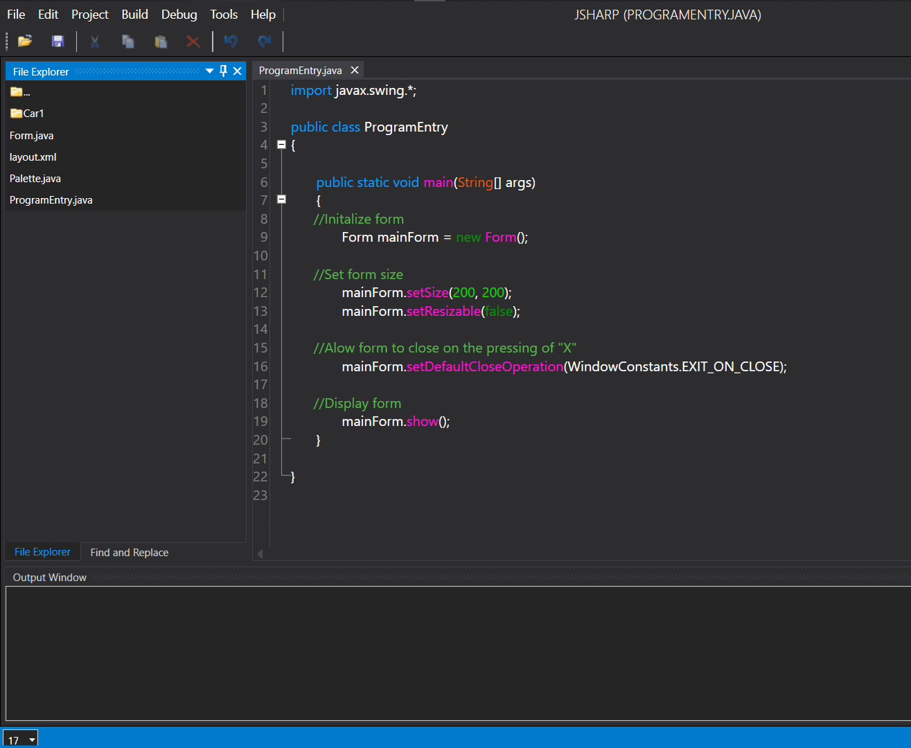
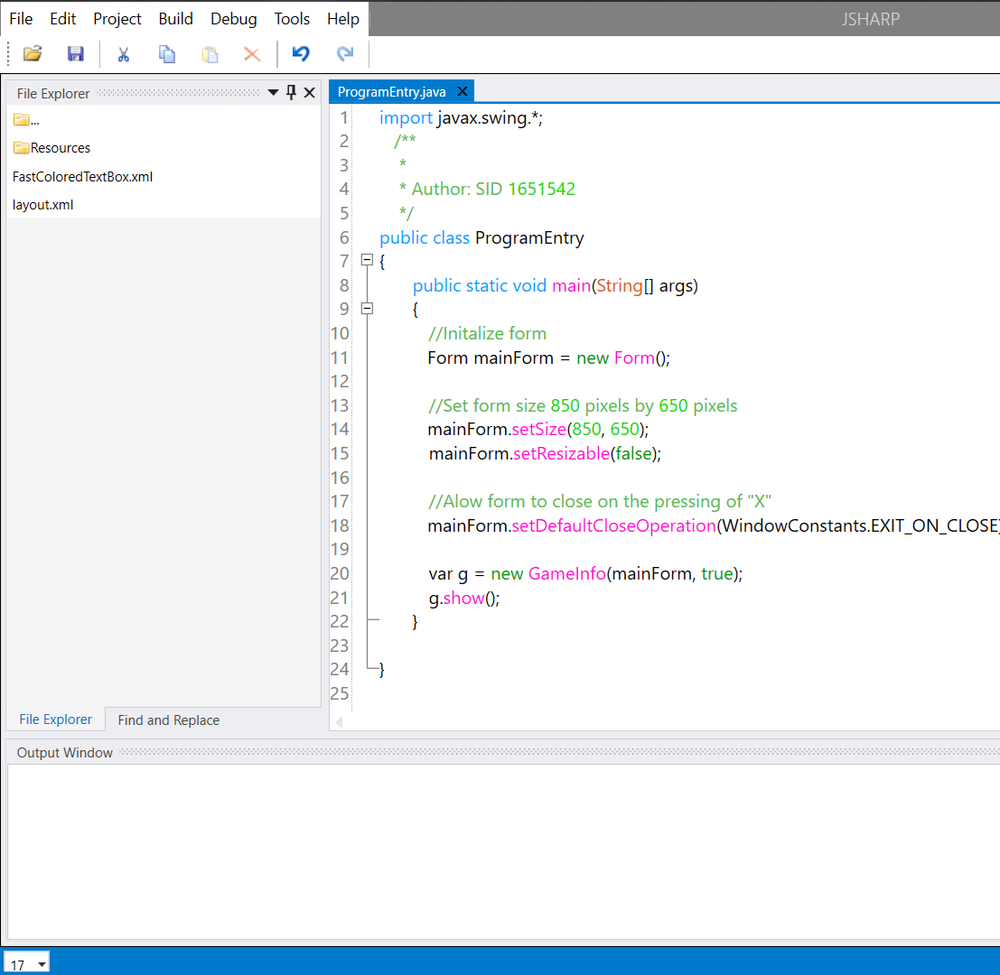

# JSharp (A minimalist java IDE)

 

## Why JSharp?

  1. Sharp has a flexible User Interface like Visual Studio. 
    	 - JSharp has a text editor with Syntax Highlighting.  		 
    	 - JSharp has support an auto-complete feature for Java.
    	 - JSharp supports plugins written in C#
    
   2. JSharp is fast and easy to use
        
   3. JSharp is able to compile java files without the need for projects
        
   4. JSharp has a basic debugger.
    
   5. JSharp is themeable

## Resources Needed to run JSharp:

  -  Microsoft .net framework 4.8
  -  Java development kit version 1.8.0_251 or higher
  -  2GB ram or more
 -   70MB hard disk space (Minimum)

## How to Build:

  Build with visual studio. No complicated process is needed to build JSharp.

## Frameworks Used:

  -  Avalon Dock => Used for docking 
  -  Avalon Edit => Used for text editor 
  -  IKVM => Used for running java code from c#
  -  MahApps.Metro => Used to create the window

## Notes:

JSharp was initially written in .net core but it was rewritten in the normal .net framework to make it work on other platforms using mono

> Plugins:

Plugins were implemented in a very straight forward way. C# reflection is used to extract data from the dll files.

A plugin project should refrence the JSharp project or "JSharp.exe" which needs all the dll files in the directory to run. It is done this way so that the plugin has direct access to the core of JSharp and vice versa.

The plugin should have one major file called "Entry.cs" which inherits IPlugin which is found in the JSharp lib. Implementing the Interface in any way desired should create a functional plugin as long as there are no build-errors or noticable bugs.

> Auto-complete:

The base which this was built on is the avalon-edit framework and IKVM. The completion window provided by avalon-edit is modified and used to display data extracted from code written using the Java reflection libruary to suggest java code (a java libruary used to analyse Java code that has already been built).

> The debugger:

JSharp uses JDB as a debugger. A GUI wrapper has been created in order to use JDB outside of the console environment

> On Syntax highlighting:

 Syntax highlighting was acchieved using avalon-edit. Custom highlighting schemes in xshd (an xml derivative) were created for JSharp. Once the custom schemes were made, classes to use them were implemented. The original Higlighting manager was not used because JSharp has a light and dark mode and highlighting colour schemes need to change as the theme changes

> Graphics/Front-end:

 MahApps.Metro and Avalon dock were used to give JSharp the clean look it has.

 

